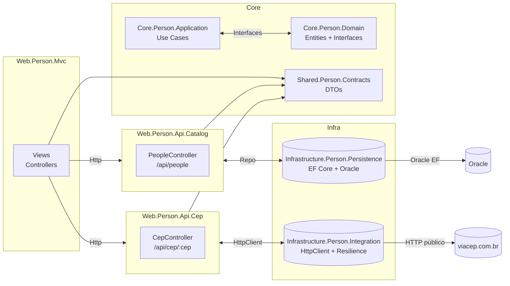

# Person — Microsserviços (.NET + Oracle + MVC)

Solução **Person.sln** com arquitetura em camadas e 2 microsserviços:

- **Web.Person.Api.Catalog**  
  API de Pessoas, CRUD conectado ao Oracle via EF Core.

- **Web.Person.Api.Cep**  
  API que integra com a API pública **ViaCEP** com resiliência (timeouts/retry).

- **Web.Person.Mvc**  
  Front-end MVC que consome as duas APIs.

- **Libraries**  
  - `Core.Person.Domain` → Entidades e contratos de domínio.  
  - `Core.Person.Application` → Casos de uso (use cases).  
  - `Infrastructure.Person.Persistence` → EF Core + Oracle + Migrations.  
  - `Infrastructure.Person.Integration` → HttpClient + Resilience.  
  - `Shared.Person.Contracts` → DTOs compartilhados.  

---

## 🎯 Objetivo

Criar uma solução alinhada a uma arquitetura de microsserviços, com separação clara de camadas, resiliência em integrações externas, boas práticas de **Clean Code** e aplicação de princípios **SOLID**.

---

## ⚙️ Pré-requisitos

- .NET SDK 8 ou 9
- Banco Oracle acessível (FIAP: `oracle.fiap.com.br:1521/ORCL`)
- Ferramenta `dotnet-ef` (para migrations)
  ```bash
  dotnet tool install -g dotnet-ef

## 🚀 Como rodar
1) Build + aplicar migrations
```
dotnet clean
dotnet restore
dotnet build

dotnet ef database update `
  -p .\Infrastructure\Infrastructure.Person.Persistence\Infrastructure.Person.Persistence.csproj `
  -s .\Web\Web.Person.Api.Catalog\Web.Person.Api.Catalog.csproj
```

2) Subir APIs e MVC (cada uma em terminal separado)
API Catalog (Oracle)
```dotnet run --project .\Web\Web.Person.Api.Catalog\Web.Person.Api.Catalog.csproj --urls http://localhost:5011```

API Cep (ViaCEP)
```dotnet run --project .\Web\Web.Person.Api.Cep\Web.Person.Api.Cep.csproj --urls http://localhost:5021```

MVC
```dotnet run --project .\Web\Web.Person.Mvc\Web.Person.Mvc.csproj --urls http://localhost:5031```

## 🌐 Endpoints
Catalog API (Oracle)

GET /api/people
```
[
  { "id": 1, "name": "Ana", "email": "ana@email.com", "cep": "01001000" }
]
```

POST /api/people
```
{ "id": 0, "name": "João", "email": "joao@email.com", "cep": "01311000" }
```
```
Swagger: http://localhost:5011/swagger
```

CEP API (ViaCEP)

GET /api/cep/01001000
```
{
  "cep": "01001-000",
  "logradouro": "Praça da Sé",
  "bairro": "Sé",
  "localidade": "São Paulo",
  "uf": "SP"
}
```
```
Swagger: http://localhost:5021/swagger
```
MVC

Interface em:
```
http://localhost:5031/people
```

Formulário para cadastrar pessoas.

Consulta CEP via API de CEP.

Lista de pessoas cadastradas (persistidas no Oracle).


## 📐 System Design



## 🧩 Princípios SOLID aplicados

- SRP (Single Responsibility Principle)

  PersonRepository: só persistência.

  CreatePerson/GetAllPeople: só regras de aplicação.

  CepApiClient: só integração externa.

- OCP (Open/Closed Principle)

  Novos casos de uso podem ser adicionados sem alterar código existente.

  Estratégias de resiliência podem ser trocadas (Polly → ResilienceHandler) sem quebrar consumo.

- DIP (Dependency Inversion Principle)

  Use Cases dependem de abstrações (IPersonRepository).

  Controllers recebem dependências via DI.

#Autor:
- Henrique Maciel

